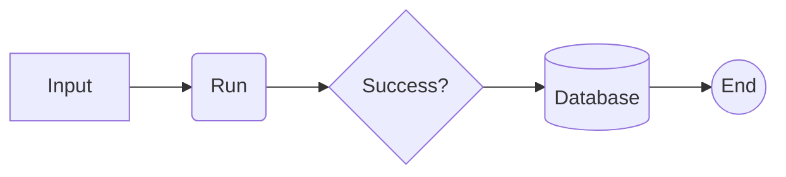
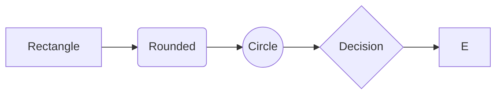

# Mermaid Diagrams in Markdown

**Mermaid is a JavaScript-based diagramming tool that lets you create flowcharts, UML diagrams, sequence diagrams, Gantt charts, ER diagrams, mind maps, and more using simple text inside Markdown.**

## Why Use Mermaid?

- ✅ Easy to write
- ✅ Version control friendly
- ✅ Works with GitHub, GitLab, Obsidian, Notion (limited), VS Code
- ✅ Great for documentation
- ✅ No need to use drawing software
- ✅ Easy to update

