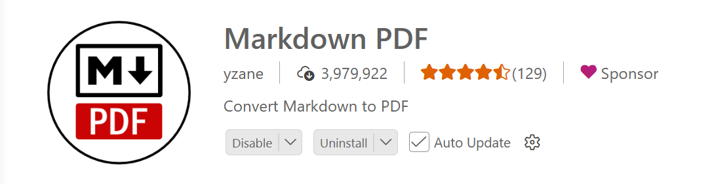

# markdown master guide

Markdown is a lightweight markup language used to format plain text into structured documents. It was created by John Gruber in 2004 to make writing for the web easier.

Instead of using complex HTML tags, Markdown uses simple symbols like #, *, -, and > to create headings, lists, tables, links, images, and more.

---

- HTML
- PDF
- Word documents
- GitHub README files
- Documentation websites
- Blogs
- Notes

---

---

## Where We Use Markdown 

| Platform         | Use Case                         |
| ---------------- | -------------------------------- |
| GitHub           | README.md, Documentation         |
| ChatGPT          | Formatting prompts and responses |
| VS Code          | Notes and documentation          |
| Obsidian         | Personal knowledge base          |
| Notion           | Notes                            |
| Jupyter Notebook | Data Science reports             |
| Docusaurus       | Documentation websites           |
| MkDocs           | Project documentation            |
| Stack Overflow   | Questions and answers            |

